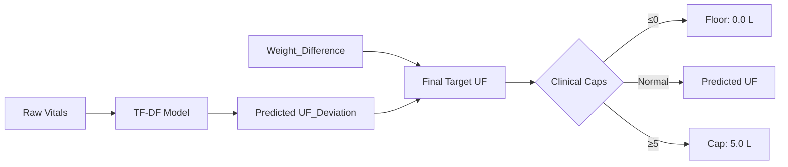

# Walkthrough: Hemodialysis Target UF Prediction Pipeline (TF-DF)

## What Was Built

A two-module, production-ready ML pipeline using **TensorFlow Decision Forests** to predict Target Ultrafiltration volume for hemodialysis patients.

### Architecture: The UF_Deviation Approach



> [!IMPORTANT]
> The model predicts `UF_Deviation = Target_UF − Weight_Difference`, **not** raw Target UF. This forces the model to learn clinician adjustments based on vitals rather than simply mirroring weight difference.

---

## Files Created

| File | Purpose |
|---|---|
| [preprocessing.py](file:///d:/Dialysis%20ML/preprocessing.py) | Data loading, regex parsing, cleaning, feature engineering, inference helper |
| [train_predict.py](file:///d:/Dialysis%20ML/train_predict.py) | TF-DF training, dual evaluation, clinical guardrails, model save/load |

### Key Functions

**[preprocessing.py](file:///d:/Dialysis%20ML/preprocessing.py)**
- [export_xlsx_to_csv()](file:///d:/Dialysis%20ML/preprocessing.py#83-124) — One-time Excel → CSV conversion
- [_parse_age_sex(val)](file:///d:/Dialysis%20ML/preprocessing.py#130-156) — Regex: `"65/M"` → [(65, 0)](file:///d:/Dialysis%20ML/train_predict.py#449-517)
- [_parse_bp(val)](file:///d:/Dialysis%20ML/preprocessing.py#158-197) — Regex: `"130/80"` → [(130.0, 80.0)](file:///d:/Dialysis%20ML/train_predict.py#449-517)
- [get_training_data(csv_path)](file:///d:/Dialysis%20ML/preprocessing.py#329-361) → [(X, y)](file:///d:/Dialysis%20ML/train_predict.py#449-517) where y = `UF_Deviation`
- [build_inference_dataframe(...)](file:///d:/Dialysis%20ML/preprocessing.py#367-439) — Constructs single-row input with `Weight_Difference`

**[train_predict.py](file:///d:/Dialysis%20ML/train_predict.py)**
- [train_model(csv_path)](file:///d:/Dialysis%20ML/train_predict.py#98-210) — Full pipeline: load → split → train → evaluate → save
- [load_model_and_predict(model, input_df)](file:///d:/Dialysis%20ML/train_predict.py#299-425) — Clinical inference with 3 guardrails
- [load_saved_model(model_dir)](file:///d:/Dialysis%20ML/train_predict.py#268-293) — Load from disk

### Clinical Guardrails

1. **Short-circuit**: `Weight_Difference ≤ 0.1 kg` → return `0.0 L` (skip model)
2. **Floor**: `max(predicted_UF, 0.0)` — UF cannot be negative
3. **Ceiling**: `min(predicted_UF, 5.0)` — prevents severe volume depletion

---

## Verification Results

### Preprocessing Self-Tests ✅
```
_parse_age_sex: ALL PASSED  (65/M, 72/Female, 30/male, bad data, NaN)
_parse_bp: ALL PASSED       (130/80, 130-80, 130, NaN)
build_inference_dataframe: PASSED
NaN weight raises ValueError: PASSED
```

### Syntax Check ✅
```
train_predict.py: Syntax OK
```

---

## How to Run

```powershell
# 1. Install TF-DF (requires Python ≤ 3.11, Linux/macOS/WSL)
pip install tensorflow_decision_forests

# 2. Run the full pipeline (auto-exports Excel → CSV if needed)
cd "d:\Dialysis ML"
python train_predict.py
```

The pipeline will: export Excel → CSV → train model → print metrics → run 3 sample predictions → save model to `uf_tfdf_model/`.
